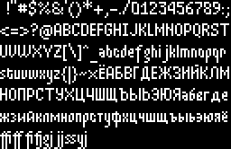

# embedded-mogeefont



# Developing

This code includes files from [mogeefont](https://github.com/kuzminadya/mogeefont) using a git submodule.
Make sure to run `git submodule init` and `git submodule update` to bring in the submodule contents.

To enter the development environment, first [install nix](https://nixos.org/download/#download-nix), enable [nix flakes](https://wiki.nixos.org/wiki/Flakes), then run:

```
nix develop
```

To regenerate the font files from the sources:

```
cargo run -p generate-font
```

# Specimen

To see the font specimen in the browser run:

```
cargo run --target wasm32-unknown-unknown -p specimen
```
