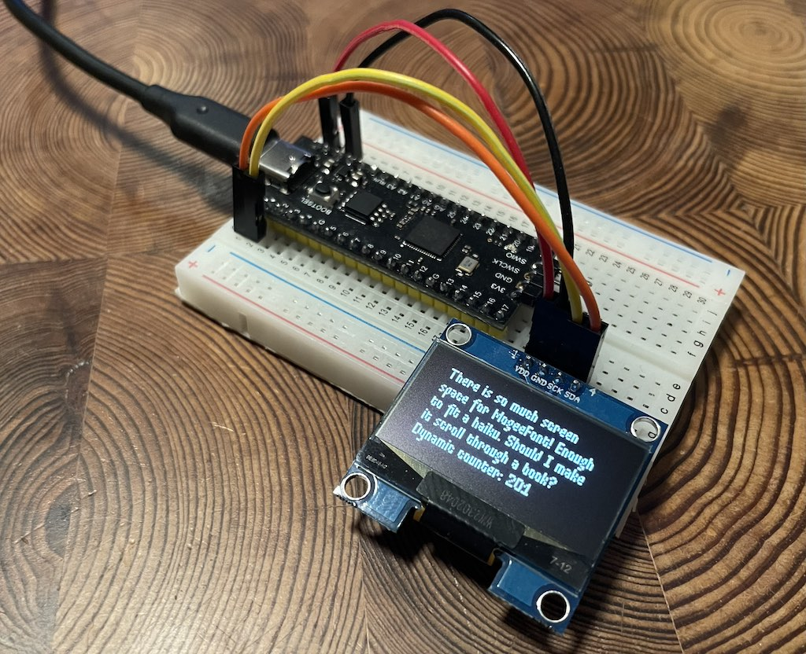

# embedded-mogeefont



Unlike many other pixel fonts, MogeeFont maximizes screen space efficiency by incorporating glyphs of variable width alongside kerning tables and ligatures.

This property makes it a great fit for the [embedded_graphics](https://github.com/embedded-graphics/embedded-graphics) ecosystem!

It was originally created by Nadya Kuzmina for a pixel game that had to fix on a 64x64 pixel screen. You can read about [the history of MogeeFont here](https://nadyakuzmina.com/story-of-mogeefont.html).

# Developing

This code includes files from the original [MogeeFont](https://github.com/kuzminadya/mogeefont) repo using a git submodule. Make sure to run `git submodule init` and `git submodule update` to bring in the submodule contents.

The easiest way to start hacking on the code is to [install nix](https://nixos.org/download/#download-nix), enable [nix flakes](https://wiki.nixos.org/wiki/Flakes), then run:

```sh
nix develop
```

To regenerate the font files from the sources:

```sh
cargo run -p generate-font
```

This command loads the pngs for glyphs, and also extracts the kerning tables from the original source code (using [tree-sitter-elm](https://github.com/elm-tooling/tree-sitter-elm) to parse the Elm module). It then assembles the sprite atlas and generates the Rust code.

# Specimen

To preview the font in the browser with the [embedded-graphics-web-simulator](https://github.com/rahul-thakoor/embedded-graphics-web-simulator), run:

```sh
cargo run --target wasm32-unknown-unknown -p specimen
```
