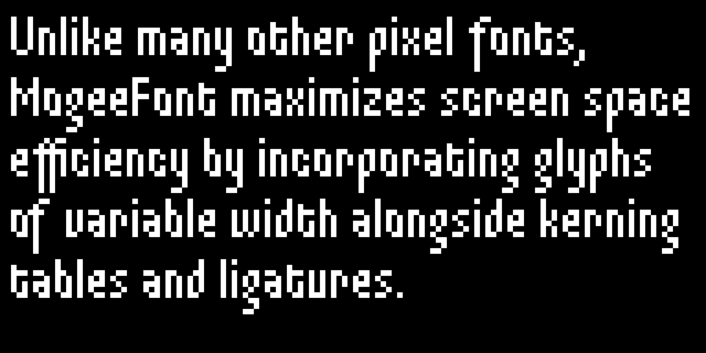
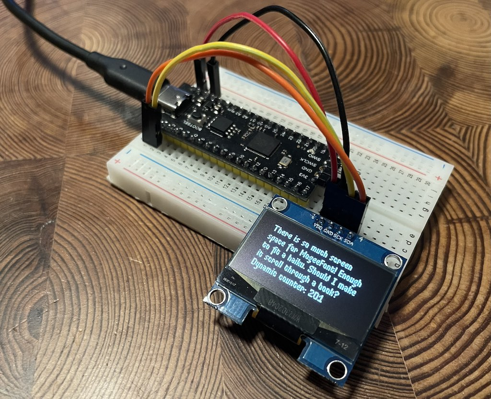

# embedded-mogeefont

MogeeFont was originally created by Nadya Kuzmina for a pixel game that had to fix on a 64×64 pixel screen. You can read about [the history of MogeeFont here](https://nadyakuzmina.com/story-of-mogeefont.html). This crate brings the font to embedded systems, it should be used together with [embedded-graphics](https://github.com/embedded-graphics/embedded-graphics) and [embedded-text](https://github.com/embedded-graphics/embedded-text).



# Developing

This code includes files from the original [MogeeFont](https://github.com/kuzminadya/mogeefont) repo using a git submodule. Make sure to run `git submodule init` and `git submodule update` to bring in the submodule contents.

The easiest way to start hacking on the code is to [install nix](https://nixos.org/download/#download-nix), enable [nix flakes](https://wiki.nixos.org/wiki/Flakes), then run:

```sh
nix develop
```

To preview the font in the browser with the [embedded-graphics-web-simulator](https://github.com/rahul-thakoor/embedded-graphics-web-simulator), run:

```sh
cargo run --target wasm32-unknown-unknown -p specimen
```

If you want it to recompile on changes, you can use `cargo-watch`:

```sh
cargo watch -x 'run --target wasm32-unknown-unknown -p specimen'
```

To regenerate the font files for the ASCII charset from the sources:

```sh
cargo run -p generate-font -- --charset ascii
```

This command loads the pngs for glyphs, and also extracts the kerning tables from the original source code (using [tree-sitter-elm](https://github.com/elm-tooling/tree-sitter-elm) to parse the Elm module). It then assembles the sprite atlas and generates the Rust code.

# Font Design

You can find the source images in the `mogeefont/font` directory. All the glyphs are named according to the Unicode code points they represent. Ligaturues are named with mulitple code points separated by underscores.

The nix shell comes with [the rx pixel editor](https://rx.cloudhead.io), which can be used to edit glyph images. It only supports 8-bit RGBA PNGs, so you may need to convert the images to this format before editing them with `mogrify`:

```sh
mogrify -depth 8 -define png:color-type=6 mogeefont/font/*.png
```
